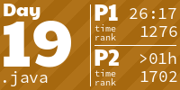
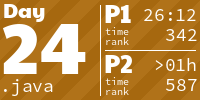
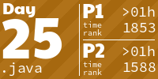

2023 AoC repo. For more detailed thoughts about the problems, see https://abnew123.substack.com/

The latest reproducible fresh-JVM benchmark averages **210.345ms of solver time**, **240.784ms from the first line of `main` through result preparation (before final result formatting and printing)**, and **279.093ms of process wall time** across 10 separate Java processes under explicitly nonuniform interactive load. The first excluded cold process measured 214.887ms solver / 246.097ms main / 280.294ms wall. These measurements are from a 2024 MacBook Pro running macOS 15.6 (24G84), aarch64, with 14 available processors and OpenJDK 23.0.1.

Day 12 now retains only two rolling DP columns instead of allocating a record-length-by-group-count matrix for every line. A counterbalanced isolated fresh-process comparison reduced its mean from 15.377ms to 14.169ms (-7.86%), with a paired 95% confidence interval of [-1.39ms, -1.03ms]; the whole-suite comparison remained inconclusive under interactive load.

Day 15 now parses the initialization sequence in one character-indexed pass and uses a direct 256-box array. Its isolated mean fell from 18.657ms to 9.239ms (-50.5%), with a paired 95% confidence interval of [-9.61ms, -9.23ms]; the whole-suite paired point estimate also favored the candidate but remained inconclusive.

Day 7 now parses each hand and bid once, maps card ranks directly, and classifies frequency groups without splitting card strings or sorting 13 counters. Its isolated mean fell from 16.925ms to 9.140ms (-46.0%), with a paired 95% confidence interval of [-8.025ms, -7.545ms]; the whole-suite paired interval also excluded zero.

Day 6 now parses both race lines once and counts strict record wins with overflow-safe integer binary search. Its isolated mean fell from 3.290ms to 1.600ms (-51.4%), with a paired 95% confidence interval of [-1.898ms, -1.481ms]; the whole-suite paired interval also excluded zero.

Day 1 now scans each calibration line once, matching overlapping digit words without temporary substrings or line buffering. Its isolated mean fell from 9.160ms to 6.473ms (-29.3%), with a paired 95% confidence interval of [-2.970ms, -2.403ms]; the whole-suite paired interval remained inconclusive under interactive load.

[`FreshJvmBenchmark`](src/FreshJvmBenchmark.java) verifies all 50 independent `solve` answers and all 25 `fullSolve` pairs before launching one cold and 10 measured child JVMs. See the [performance notes](PERFORMANCE.md) for commands, raw samples, timing definitions, paired optimization comparisons, and historical benchmark caveats.

```shell
mkdir -p /tmp/aoc2023-classes
javac -d /tmp/aoc2023-classes $(git ls-files '*.java' ':!src/tests/**')
java -cp /tmp/aoc2023-classes src.FreshJvmBenchmark --verify
java -cp /tmp/aoc2023-classes src.FreshJvmBenchmark
```

[](https://sonarcloud.io/summary/new_code?id=abnew123_aoc2023)
[](https://sonarcloud.io/summary/new_code?id=abnew123_aoc2023)

<!-- AOC TILES BEGIN -->
<h1 align="center">
  2023 - 50 ⭐
</h1>
<a href="src/solutions/Day01.java">
  
</a>
<a href="src/solutions/Day02.java">
  
</a>
<a href="src/solutions/Day03.java">
  
</a>
<a href="src/solutions/Day04.java">
  
</a>
<a href="src/solutions/Day05.java">
  
</a>
<a href="src/solutions/Day06.java">
  
</a>
<a href="src/solutions/Day07.java">
  
</a>
<a href="src/solutions/Day08.java">
  
</a>
<a href="src/solutions/Day09.java">
  
</a>
<a href="src/solutions/Day10.java">
  
</a>
<a href="src/solutions/Day11.java">
  
</a>
<a href="src/solutions/Day12.java">
  
</a>
<a href="src/solutions/Day13.java">
  
</a>
<a href="src/solutions/Day14.java">
  
</a>
<a href="src/solutions/Day15.java">
  
</a>
<a href="src/solutions/Day16.java">
  
</a>
<a href="src/solutions/Day17.java">
  
</a>
<a href="src/solutions/Day18.java">
  
</a>
<a href="src/solutions/Day19.java">
  
</a>
<a href="src/solutions/Day20.java">
  
</a>
<a href="src/solutions/Day21.java">
  
</a>
<a href="src/solutions/Day22.java">
  
</a>
<a href="src/solutions/Day23.java">
  
</a>
<a href="src/solutions/Day24.java">
  
</a>
<a href="src/solutions/Day25.java">
  
</a>
<!-- AOC TILES END -->

## Historical warm per-part timings

The table below is retained from the earlier July benchmark pass. Its values are warm 10-run per-part averages using `DayTemplate.timer`; they are useful historical context, but they are not fresh-JVM wall times and should not be compared directly with the current measurements above.

| Day | Problem | Solution | Part 1 (ms) | Part 2 (ms) |
| --- | --- | --- |------------:|------------:|
| 1 | [Trebuchet?!](https://adventofcode.com/2023/day/1) | [Source](src/solutions/Day01.java) | 1.502 | 2.107 |
| 2 | [Cube Conundrum](https://adventofcode.com/2023/day/2) | [Source](src/solutions/Day02.java) | 2.026 | 2.095 |
| 3 | [Gear Ratios](https://adventofcode.com/2023/day/3) | [Source](src/solutions/Day03.java) | 2.510 | 2.245 |
| 4 | [Scratchcards](https://adventofcode.com/2023/day/4) | [Source](src/solutions/Day04.java) | 2.931 | 3.084 |
| 5 | [If You Give A Seed A Fertilizer](https://adventofcode.com/2023/day/5) | [Source](src/solutions/Day05.java) | 1.199 | 1.251 |
| 6 | [Wait For It](https://adventofcode.com/2023/day/6) | [Source](src/solutions/Day06.java) | 0.517 | 0.597 |
| 7 | [Camel Cards](https://adventofcode.com/2023/day/7) | [Source](src/solutions/Day07.java) | 3.418 | 3.318 |
| 8 | [Haunted Wasteland](https://adventofcode.com/2023/day/8) | [Source](src/solutions/Day08.java) | 3.894 | 7.632 |
| 9 | [Mirage Maintenance](https://adventofcode.com/2023/day/9) | [Source](src/solutions/Day09.java) | 2.123 | 2.174 |
| 10 | [Pipe Maze](https://adventofcode.com/2023/day/10) | [Source](src/solutions/Day10.java) | 1.747 | 2.316 |
| 11 | [Cosmic Expansion](https://adventofcode.com/2023/day/11) | [Source](src/solutions/Day11.java) | 3.555 | 3.539 |
| 12 | [Hot Springs](https://adventofcode.com/2023/day/12) | [Source](src/solutions/Day12.java) | 2.577 | 6.584 |
| 13 | [Point of Incidence](https://adventofcode.com/2023/day/13) | [Source](src/solutions/Day13.java) | 1.900 | 1.836 |
| 14 | [Parabolic Reflector Dish](https://adventofcode.com/2023/day/14) | [Source](src/solutions/Day14.java) | 1.083 | 6.950 |
| 15 | [Lens Library](https://adventofcode.com/2023/day/15) | [Source](src/solutions/Day15.java) | 2.499 | 4.944 |
| 16 | [The Floor Will Be Lava](https://adventofcode.com/2023/day/16) | [Source](src/solutions/Day16.java) | 1.207 | 12.652 |
| 17 | [Clumsy Crucible](https://adventofcode.com/2023/day/17) | [Source](src/solutions/Day17.java) | 8.955 | 12.633 |
| 18 | [Lavaduct Lagoon](https://adventofcode.com/2023/day/18) | [Source](src/solutions/Day18.java) | 1.800 | 2.149 |
| 19 | [Aplenty](https://adventofcode.com/2023/day/19) | [Source](src/solutions/Day19.java) | 3.888 | 4.643 |
| 20 | [Pulse Propagation](https://adventofcode.com/2023/day/20) | [Source](src/solutions/Day20.java) | 1.892 | 4.096 |
| 21 | [Step Counter](https://adventofcode.com/2023/day/21) | [Source](src/solutions/Day21.java) | 3.424 | 3.397 |
| 22 | [Sand Slabs](https://adventofcode.com/2023/day/22) | [Source](src/solutions/Day22.java) | 5.588 | 6.383 |
| 23 | [A Long Walk](https://adventofcode.com/2023/day/23) | [Source](src/solutions/Day23.java) | 6.997 | 11.799 |
| 24 | [Never Tell Me The Odds](https://adventofcode.com/2023/day/24) | [Source](src/solutions/Day24.java) | 2.597 | 4.994 |
| 25 | [Snowverload](https://adventofcode.com/2023/day/25) | [Source](src/solutions/Day25.java) | 5.419 | 0.001 |
