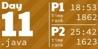
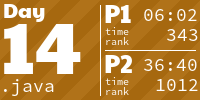
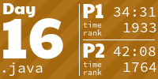
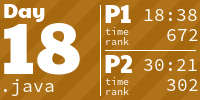

2023 AoC repo. For more detailed thoughts about the problems, see https://abnew123.substack.com/

Total run time of all 50 parts is roughly 1.3 seconds on my 2019 Macbook Pro. Days 16 & 17 take up the most time at roughly 250ms each.  

<!-- AOC TILES BEGIN -->
<h1 align="center">
  2023 - 50 ⭐
</h1>

<!-- AOC TILES END -->

| Day | Problem | Solution | Benchmark (ms) |
| --- | --- | --- | --: |
| 1 | [Trebuchet?!](https://adventofcode.com/2023/day/1) | [Source](src/solutions/Day01.java) | 42 |
| 2 | [Cube Conundrum](https://adventofcode.com/2023/day/2) | [Source](src/solutions/Day02.java) | 19 |
| 3 | [Gear Ratios](https://adventofcode.com/2023/day/3) | [Source](src/solutions/Day03.java) | 21 |
| 4 | [Scratchcards](https://adventofcode.com/2023/day/4) | [Source](src/solutions/Day04.java) | 23 |
| 5 | [If You Give A Seed A Fertilizer](https://adventofcode.com/2023/day/5) | [Source](src/solutions/Day05.java) | 11 |
| 6 | [Wait For It](https://adventofcode.com/2023/day/6) | [Source](src/solutions/Day06.java) | 6 |
| 7 | [Camel Cards](https://adventofcode.com/2023/day/7) | [Source](src/solutions/Day07.java) | 32 |
| 8 | [Haunted Wasteland](https://adventofcode.com/2023/day/8) | [Source](src/solutions/Day08.java) | 50 |
| 9 | [Mirage Maintenance](https://adventofcode.com/2023/day/9) | [Source](src/solutions/Day09.java) | 12 |
| 10 | [Pipe Maze](https://adventofcode.com/2023/day/10) | [Source](src/solutions/Day10.java) | 54 |
| 11 | [Cosmic Expansion](https://adventofcode.com/2023/day/11) | [Source](src/solutions/Day11.java) | 34 |
| 12 | [Hot Springs](https://adventofcode.com/2023/day/12) | [Source](src/solutions/Day12.java) | 68 |
| 13 | [Point of Incidence](https://adventofcode.com/2023/day/13) | [Source](src/solutions/Day13.java) | 11 |
| 14 | [Parabolic Reflector Dish](https://adventofcode.com/2023/day/14) | [Source](src/solutions/Day14.java) | 62 |
| 15 | [Lens Library](https://adventofcode.com/2023/day/15) | [Source](src/solutions/Day15.java) | 15 |
| 16 | [The Floor Will Be Lava](https://adventofcode.com/2023/day/16) | [Source](src/solutions/Day16.java) | 263 |
| 17 | [Clumsy Crucible](https://adventofcode.com/2023/day/17) | [Source](src/solutions/Day17.java) | 253 |
| 18 | [Lavaduct Lagoon](https://adventofcode.com/2023/day/18) | [Source](src/solutions/Day18.java) | 5 |
| 19 | [Aplenty](https://adventofcode.com/2023/day/19) | [Source](src/solutions/Day19.java) | 18 |
| 20 | [Pulse Propagation](https://adventofcode.com/2023/day/20) | [Source](src/solutions/Day20.java) | 79 |
| 21 | [Step Counter](https://adventofcode.com/2023/day/21) | [Source](src/solutions/Day21.java) | 13 |
| 22 | [Sand Slabs](https://adventofcode.com/2023/day/22) | [Source](src/solutions/Day22.java) | 51 |
| 23 | [A Long Walk](https://adventofcode.com/2023/day/23) | [Source](src/solutions/Day23.java) | 81 |
| 24 | [Never Tell Me The Odds](https://adventofcode.com/2023/day/24) | [Source](src/solutions/Day24.java) | 41 |
| 25 | [Snowverload](https://adventofcode.com/2023/day/25) | [Source](src/solutions/Day25.java) | 20 |
